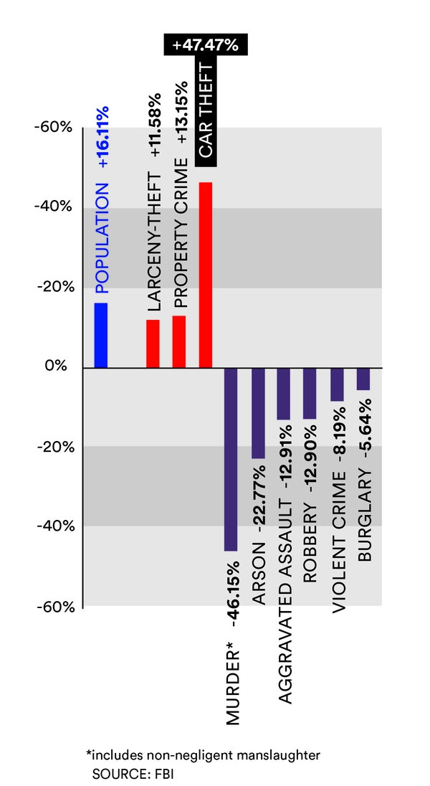

The following image was obtained in: [www.wweek.com](http://www.wweek.com/news/courts/2017/10/04/fbi-statistics-show-crime-is-flat-or-down-across-portland-except-in-one-key-category/)





The news content it is a response to a statement made by the US U.S. Attorney General. Jeff Sessions said that Portland crimes rates were increased after a period of good indicators. To oppose that, the news shows the graphic above and discuss their values. They show a decrease in violent crimes and an increase in crimes against property. 

The graph sustains their claims but there some issues,  the absolute values are not mentioned, neither how the data was collected. Without this informations, it is impossible to have a clear idea of the real condition of public security in Portland. Only relative data don't give us conditions to compare with other cities, for example. 

The only assurance that the date is correct is based on an argument of authority, by referring the FBI as the source of this information. 

```{r}

```


